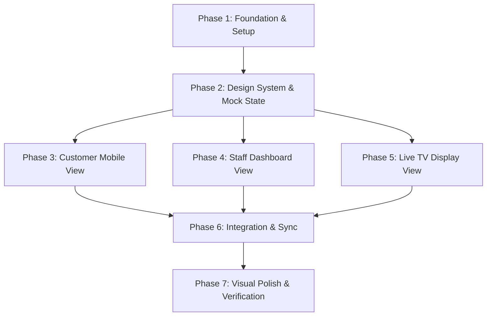

# Build Plan: Walbox v2

This document details the progressive execution path for the development of the Walbox v2 MVP. Work is planned in discrete, incremental phases to ensure quality and testability at every stage.

---

## Phased Execution Roadmap



### Phase 1: Foundation & Project Setup
*   **Goal:** Initialize the Vite + React workspace, configure path aliases, install basic icons/utilities, and establish folder architecture.
*   **Tasks:**
    *   Create Vite React app template (using TS or JS as decided).
    *   Configure clean folder structure (components, layouts, state, styles, assets).
    *   Setup router (e.g., `react-router-dom`) to manage `/customer`, `/dashboard`, and `/tv` screens.

### Phase 2: Design System & Mock State Layer
*   **Goal:** Establish styling tokens and the core logic for the simulated music system.
*   **Tasks:**
    *   Implement global CSS design system with HSL variables (glassmorphic helper classes, font families, dark-mode variables).
    *   Write the local state manager (using React Context or standard local state synced to `localStorage` to allow different browser tabs representing Customer, Staff, and TV to coordinate).
    *   Create a local dataset of mock songs (e.g., 50 popular tracks with titles, artists, cover images, durations, and moods).

### Phase 3: Customer Mobile View
*   **Goal:** Build the request funnel for customers scanning QR codes.
*   **Tasks:**
    *   Mobile wrapper layout with table identification.
    *   List view of mock songs with interactive search filter.
    *   Mood selection chip panel.
    *   Dedication input form with dynamic validations.
    *   Submission animation leading to the "Pending Request" status screen.

### Phase 4: Staff Dashboard View
*   **Goal:** Create the queue management hub for staff.
*   **Tasks:**
    *   Desktop split-pane layout (left: pending queue, center: active/upcoming playlist, right: venue controls & currently playing).
    *   Interactive swipe/action buttons (Approve, Skip, Prioritize).
    *   Active playback controller (play/pause, skip track, time elapsed progress simulator).

### Phase 5: Live TV Display View
*   **Goal:** Create the large-format display designed to captivate the room.
*   **Tasks:**
    *   1080p layout optimized for screen display.
    *   "Now Playing" card overlay with rotating/pulsing cover art.
    *   Continuous scrolling ticker displaying active customer dedications.
    *   Background gradient meshes animated with CSS transitions that shift colors depending on the active song's mood.

### Phase 6: Integration & Sync
*   **Goal:** Connect the three client views into a unified reactive simulation.
*   **Tasks:**
    *   Integrate cross-tab communication (using a `StorageEvent` listener on `localStorage` or simple shared state).
    *   Verify that submitting a request from the Customer mobile view immediately places it in the Staff Dashboard.
    *   Verify that staff approval moves the song into the upcoming queue visible on both the Staff Dashboard and Live TV screen.

### Phase 7: Visual Polish & Verification
*   **Goal:** Upgrade the MVP's visual identity to look premium.
*   **Tasks:**
    *   Add micro-interactions (magnetic buttons, tap feedback, hover glows).
    *   Optimize typography sizes and screen responsiveness.
    *   Conduct end-to-end user tests across mobile and desktop viewports.

---

## What NOT to Build Now (Out of Scope Constraints)
*   **No backend infrastructure:** Do not provision databases, APIs, server setups, or web sockets.
*   **No integrations:** Do not configure Spotify developer accounts, OAuth credentials, or Supabase projects.
*   **No authorization logic:** Do not build user login screens, staff registration, password resets, or authentication middleware.

---

## Prossimo Step Tecnico Singolo (Next Single Technical Step)
The absolute next step is to **initialize the Vite + React workspace** inside the workspace directory (`walbox-from-zero-v2`).
This includes executing:
```bash
npx -y create-vite@latest ./ --template react
```
*(or react-ts)* followed by dependency installation and routing initialization.
