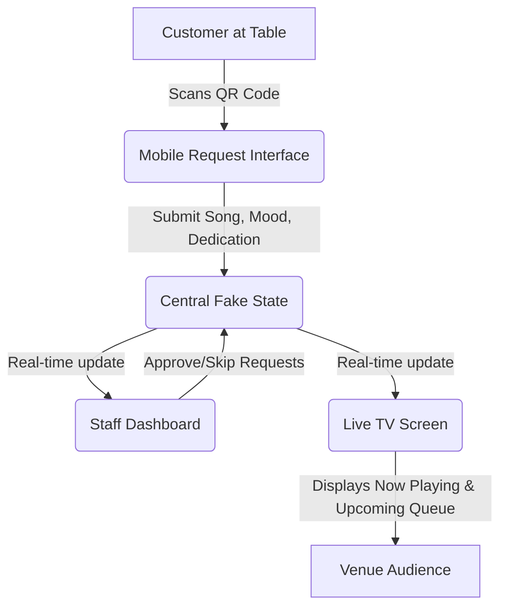

# Project Context: Walbox v2

Walbox is an interactive social jukebox experience for venues (bars, clubs, restaurants, events). It connects customers at their tables to the venue's live music queue, creating an engaging, communal, and highly visual environment.

This project, **walbox-from-zero-v2**, is a complete rebuild of the original Walbox concept as a modern, high-fidelity Minimum Viable Product (MVP) using **React** and **Vite**. The goal is to focus on visual excellence, fluid micro-interactions, and simplicity, using the original Walbox only as a conceptual benchmark.

---

## The Core Concept (Conceptual Benchmark)

1. **QR at Table:** Customers scan a QR code placed at their table, which opens a mobile-optimized web application on their phone.
2. **Interactive Request:** Customers can select a song (mocked), specify their current mood, and write a dedication/message.
3. **Staff Control (Dashboard):** Staff members monitor incoming requests, manage the queue (approve, skip, prioritize), and maintain control over what plays.
4. **Live TV Screen:** A public display screen (projector or TV in the venue) showing the current song, upcoming queue, and dynamic visual callouts for dedications and moods.

---

## Rebuilding From Zero (v2 Philosophy)

The original codebase served its purpose as a prototype, but v2 is designed to establish a clean, maintainable, and modern foundation:

*   **Aesthetics First:** A premium visual layout. We avoid basic wireframe styling. Instead, we use glassmorphism, sleek dark modes, rich gradients, and custom modern typography.
*   **Zero Legacy Code:** No copy-pasting from the old repository. We construct components fresh to ensure clean patterns.
*   **Simple State Flow:** Before introducing complex cloud databases or microservices, the MVP will utilize a robust, client-driven fake local state. This allows immediate testing of the UX/UI without backend overhead.
*   **High-fidelity Mocking:** Key integrations like Spotify and Supabase are designed with abstract interfaces, allowing us to mock them fully for the MVP and swap them with real services later.
