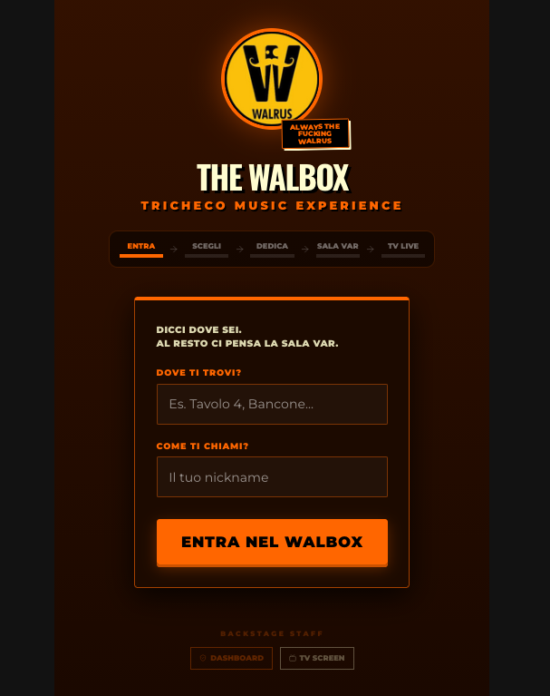
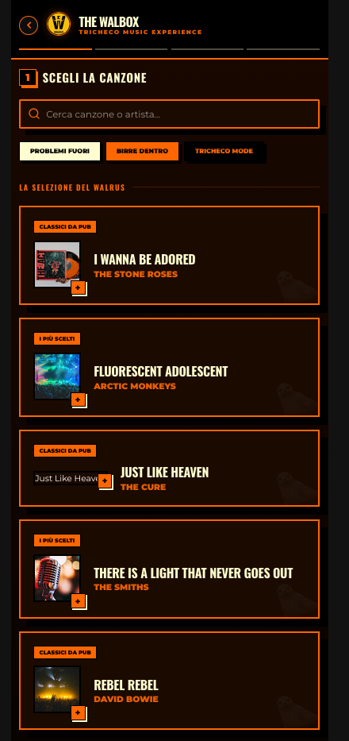
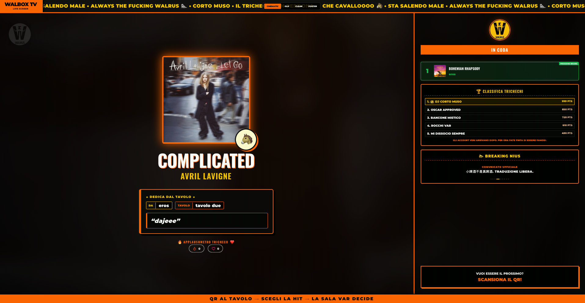
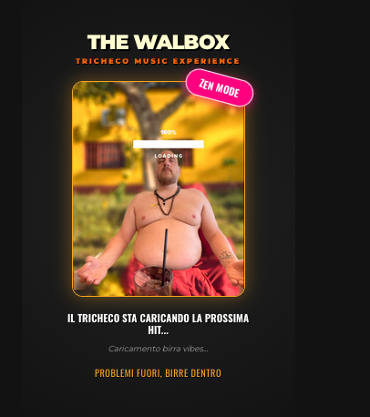

# Walbox Original Screenshot Reference - Guida Visiva al Rebrand

Questo file descrive in dettaglio i quattro screenshot di riferimento salvati nella cartella `_rebrand_pack/screenshots/`. Questi file costituiscono il riferimento estetico per la trasformazione visuale di **Walbox From Zero V2**, mantenendo l'attuale codice di V2 come base funzionale e logica.

---

## Indice degli Screenshot e Analisi

### 1. 01-customer-entry-original.png

*   **Schermata rappresentata**: Schermata di ingresso del cliente (Mobile Customer Login / Entry).
*   **Elementi visivi importanti**:
    *   **Sfondo**: Gradiente caldo dal marrone cioccolato al nero (`linear-gradient(180deg, #331100 0%, #1a0800 100%)`).
    *   **Identità**: Logo del tricheco centrale circolare con bordo neon arancione (`#ff6600`) e glow sfocato.
    *   **Dettaglio Sticker**: Badge inclinata stile adesivo con scritta nera su sfondo arancione "**ALWAYS THE FUCKING WALRUS**" e ombra crema solida.
    *   **Titoli**: Titolo principale "**THE WALBOX**" di colore crema `#fffdd0` con ombra nera piatta e spessa 4px a destra e in basso (`text-shadow: 4px 4px 0 #000`).
    *   **Contenitore Form**: Box scuro `#1c0a00` con bordo arancione e testata spessa da `5px solid #ff6600` che richiama la superficie del bancone del pub.
    *   **Pulsanti**: Tasto arancione neon con ombra marrone scuro solida proiettata in basso per un effetto 3D piatto (cabinato arcade).
*   **Cosa deve imparare un futuro agente (Rebrand V2)**:
    *   L'uso del contrasto estremo tra il crema `#fffdd0`, l'arancio `#ff6600` e i marroni scurissimi di sfondo.
    *   L'effetto sticker con etichette ruotate di circa 8 gradi.
    *   Le ombre solide traslate senza sfocatura.
*   **Cosa NON deve copiare**:
    *   La logica di invio dati dell'utente, il routing o il salvataggio dei cookie locali. In V2 la sottomissione deve sfruttare l'architettura di autenticazione e sessione nativa.
*   **Priorità di Rebrand**: Media.
*   **Note operative per V2**:
    *   Sostituire la classe di sfondo e i colori del modulo di login di V2 importando lo stile del bancone.
    *   Preservare i controlli di validazione dei campi input di V2 (es. lunghezza minima nome o controllo formati tavolo).

---

### 2. 02-customer-jukebox-original.png

*   **Schermata rappresentata**: Interfaccia Mobile del Jukebox per il cliente (Customer Jukebox UI).
*   **Elementi visivi importanti**:
    *   **Header**: Barra superiore fissa nera con logo circolare, tasto indietro circolare rosso/arancio e bordo inferiore spesso.
    *   **Ricerca**: Input di ricerca alto 55px con bordo arancione forte e ombra nera piatta.
    *   **Card della Canzone**: Box scuro con bordo arancio e ombra nera solida. Dispone di una label orizzontale superiore (es. "CLASSICI DA PUB") e della copertina quadrata con un badge "+" angolare stile 3D flat.
    *   **Selezione Mood**: Griglia a 2 colonne. Ogni bottone ha un'emoji grande al centro. Il bottone selezionato diventa a sfondo arancione con bordo crema spesso (`4px solid #fffdd0`) e un pallino notifica fucsia ad angolo.
    *   **Dedica**: Textarea con font monospazio e contatore caratteri ad angolo.
    *   **Modale di Successo**: Sfondo oscurato al 95% con sfocatura, scritte gigantesche in arancione peso 950 ("**CHE CAVALLOOOO 🐴**") e tasto "**OK, MI DISSOCIO**".
*   **Cosa deve imparare un futuro agente (Rebrand V2)**:
    *   L'impaginazione a step verticali chiari (1. Canzone, 2. Mood, 3. Dedica, 4. Invia).
    *   La stilizzazione spigolosa e bidimensionale con ombre a blocco solido di colore nero `#000`.
    *   Il tono dissacrante e calcistico del modale di invio.
*   **Cosa NON deve copiare**:
    *   I mock statici delle canzoni o dei mood.
    *   Le chiamate dirette all'SDK di Spotify client-side. In V2, la ricerca deve passare attraverso l'endpoint o servizio di backend centralizzato.
*   **Priorità di Rebrand**: Alta.
*   **Note operative per V2**:
    *   Mantenere intatta la gestione dello stato di ricerca e selezione canzoni in V2. Modificare esclusivamente le classi CSS dei bottoni, degli input e delle card.
    *   Adattare i messaggi di conferma di invio brano di V2 incorporando le esclamazioni originali.

---

### 3. 03-live-tv-original.png

*   **Schermata rappresentata**: Schermata Live TV del pub (Live TV Presentation Screen).
*   **Elementi visivi importanti**:
    *   **Ticker Superiore**: Sezione "WALBOX TV" fissa a sinistra, marquee scorrevole continuo a destra con frasi in oro `#ffcc00` su sfondo nero.
    *   **Ambient Glow**: Sfondo sfuocato al 50px saturo basato sull'artwork del brano attualmente in esecuzione.
    *   **Effetto CRT**: Griglia rasterizzata a righe orizzontali ad opacità 0.3.
    *   **Layout Sinistro**: Copertina della canzone con neon glow arancione pulsante. Titolo gigantesco con doppia ombra (`4px 4px 0 #ff6600, 8px 8px 0 #000`). Box della dedica con bordo arancione da 15px e dettagli tavolo/utente ben visibili.
    *   **Layout Destro (Sidebar)**: Lista della coda brani approvati, classifica "Trichechi" con scritte dorate, e la sezione "BREAKING NIUS" con messaggi rotanti sul consumo della birra.
*   **Cosa deve imparare un futuro agente (Rebrand V2)**:
    *   Il posizionamento asimmetrico e il bilanciamento visivo pensato per schermi TV da 50-60 pollici.
    *   L'utilizzo delle animazioni CSS per il testo scorrevole e il bagliore neon pulsante.
    *   La visualizzazione della dedica come cartello speciale ad alto contrasto.
*   **Cosa NON deve copiare**:
    *   La barra con i pulsanti per cambiare al volo i variant template (`cinematic`, `old`, `clean`, `poster`). In V2 la TV deve avere un aspetto standardizzato e pulito, gestito automaticamente da configurazione o backend.
    *   I punteggi fake della classifica; V2 deve visualizzare i dati della classifica elaborati dal database reale.
*   **Priorità di Rebrand**: Alta.
*   **Note operative per V2**:
    *   Mantenere la sincronizzazione della riproduzione in tempo reale di V2 (via socket o polling). Re-implementare il layout visuale a due colonne basandosi sulle scanline CRT e sull'ambient glow.
    *   Implementare l'applausometro di V2 con lo stile delle emoticon fluttuanti del ReactionBar.

---

### 4. 04-loading-original.png

*   **Schermata rappresentata**: Schermata di caricamento / attesa iniziale (Zen Loading Screen).
*   **Elementi visivi importanti**:
    *   **Sfondo**: Gradiente radiale scuro e pulito.
    *   **Immagine Centrale**: L'illustrazione `walrus-budda-cocktail.png` circondata da un bordo oro, animata con un movimento oscillatorio verticale continuo.
    *   **Sticker Zen**: Badge fucsia inclinato con effetto neon ("ZEN MODE").
    *   **Copy**: Messaggio ironico: *"IL TRICHECO STA CARICANDO LA PROSSIMA HIT... Caricamento birra vibes... Problemi fuori, birre dentro"*.
*   **Cosa deve imparare un futuro agente (Rebrand V2)**:
    *   L'applicazione di animazioni fluide ma non invasive (`y: [0, -10, 0]`) per intrattenere l'utente durante i caricamenti.
    *   L'uso dell'accento fucsia/social per dare freschezza e contrasto.
*   **Cosa NON deve copiare**:
    *   Il timer fisso a 3.5 secondi. In V2 la schermata di caricamento deve scomparire solo quando l'applicazione ha completato le connessioni e l'inizializzazione dei dati.
*   **Priorità di Rebrand**: Bassa.
*   **Note operative per V2**:
    *   Integrare l'immagine del Buddha Tricheco come asset di fallback di caricamento all'interno di V2, applicando il badge Zen inclinata tramite CSS.

---

## How to use these screenshots in Walbox From Zero V2

Quando si lavora sul codice di *Walbox From Zero V2*, l'agente frontend deve procedere come segue:

1.  **Fase di Analisi Visiva**: Tenere aperti questi screenshot (in `_rebrand_pack/screenshots/`) insieme al codice di V2 per confrontare costantemente il layout.
2.  **Modifica solo del CSS/HTML**: Applicare le modifiche stilistiche (bordo superiore di 5px solid, ombre solide 8px, gradienti lineari cioccolato) esclusivamente ai fogli di stile di V2 o ai componenti di interfaccia di V2.
3.  **Protezione Logica**: Non importare in nessun caso blocchi logici o di stato presi dai vecchi componenti (ad es. la gestione dei socket della TV o la ricerca di Spotify nel mobile). Se in V2 una determinata feature logica manca (es. la classifica), l'agente deve implementarla sfruttando l'architettura di V2, copiano solo il design visuale documentato in questi file.
4.  **Tono del Copy**: Sostituire le stringhe statiche o i placeholder di V2 con i termini storici estratti (es. cambiare "Invio riuscito" con "CHE CAVALLOOOO 🐴").
